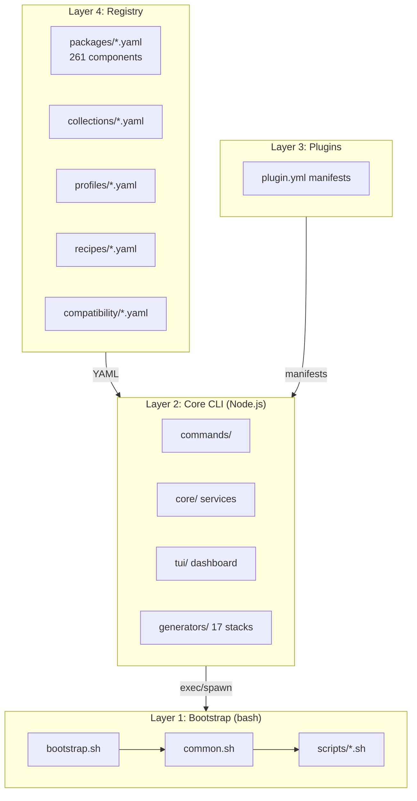
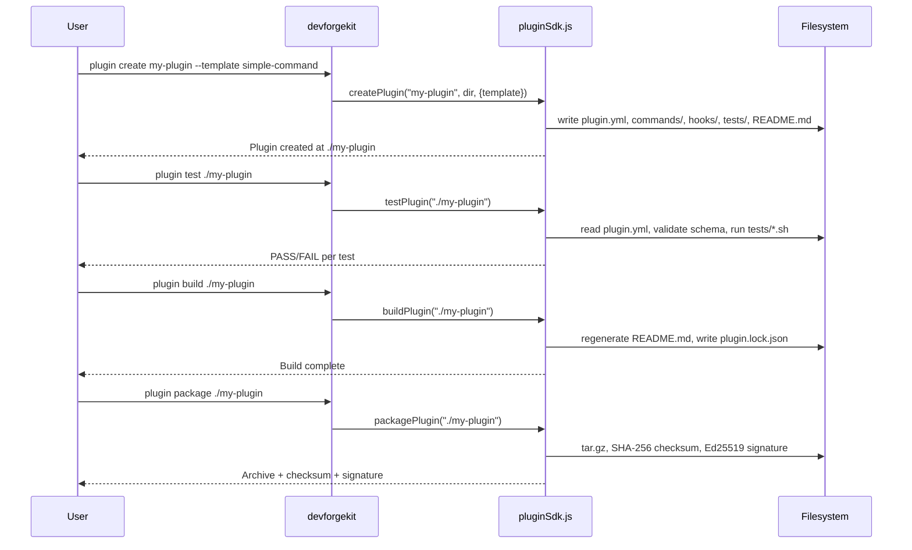
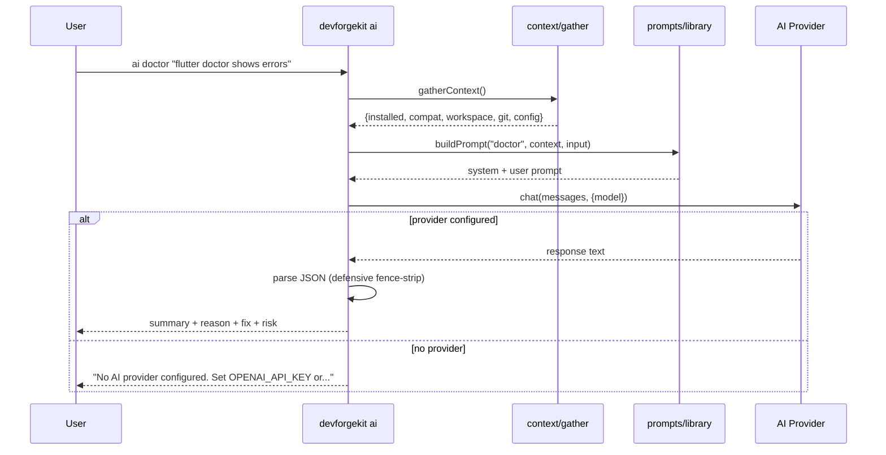

# Architecture Diagrams

Visual reference for DevForgeKit's structure, data flow, and key
sequences. All diagrams use ASCII art (renderable in any terminal) and
[Mermaid](https://mermaid.js.org/) syntax (renderable on GitHub).

## Four-layer architecture

```
┌─────────────────────────────────────────────────────────┐
│                    Layer 4: Registry                      │
│  registry/packages/*.yaml (261 components, 35 categories) │
│  registry/collections/*.yaml (17 collections)             │
│  registry/profiles/*.yaml (50 profiles)                   │
│  registry/recipes/*.yaml (8 recipes)                      │
│  registry/compatibility/*.yaml (196 rule files)           │
│  registry/schema/*.schema.json (AJV validation)           │
└────────────────────────┬────────────────────────────────┘
                         │ YAML manifests (read-only)
┌────────────────────────┴────────────────────────────────┐
│                    Layer 3: Plugins                        │
│  plugins/hello-world/          (bundled example)           │
│  ~/.devforgekit/plugins/*/     (user-installed)            │
│  plugin.yml (schema v2) + commands/ + hooks/ + tests/      │
└────────────────────────┬────────────────────────────────┘
                         │ plugin.yml manifests
┌────────────────────────┴────────────────────────────────┐
│              Layer 2: Core CLI (Node.js ESM)               │
│                                                            │
│  cli/bin/devforgekit.js  ──→  src/index.js (commander)     │
│                                   │                        │
│  ┌───────────────┬──────────────┬┴────────────┬─────────┐ │
│  │   commands/   │    core/     │   tui/       │generators│ │
│  │  (CLI handlers)│  (services)  │ (dashboard)  │(17 stacks)│ │
│  └───────────────┴──────────────┴──────────────┴─────────┘ │
│                                                            │
│  core/: registry, installer, plugins, config, shell,       │
│         health, quality, devGraph, packageIntel,           │
│         benchmark, repair, snapshot, workspace,            │
│         compatibility, ai, platform, pluginSdk,            │
│         pluginValidation                                    │
└────────────────────────┬────────────────────────────────┘
                         │ exec / spawn
┌────────────────────────┴────────────────────────────────┐
│             Layer 1: Bootstrap (bash 3.2)                  │
│                                                            │
│  bootstrap.sh  ──→  scripts/common.sh  ──→  scripts/*.sh   │
│  (orchestrator)      (shared library)      (single-purpose) │
│                                                            │
│  colors.sh → common.sh → {install, restore, backup,        │
│    update, check, doctor, services, validate, cleanup,     │
│    report, inventory, preferences, profile, release}.sh    │
│                                                            │
│  Constraint: must run on stock macOS /bin/bash 3.2.        │
│  No bash 4+ features. No Node dependency.                  │
└─────────────────────────────────────────────────────────┘
```



## Command dispatch flow

```
User runs: ./devforgekit <command> [args...]

         ┌──────────────────┐
         │  devforgekit      │
         │  (root dispatcher)│
         └────────┬──────────┘
                  │
         ┌────────▼──────────┐
         │  $1 = "install"   │
         │  or "bootstrap"?  │
         └────────┬──────────┘
             Yes  │         No
         ┌────────▼──┐  ┌───▼──────────────┐
         │ exec      │  │ node + node_modules│
         │ bootstrap │  │ exist?             │
         │ .sh       │  └───┬───────────────┘
         └───────────┘   Yes│         No
                    ┌──────▼──┐  ┌──▼──────────┐
                    │ exec    │  │ exec scripts/│
                    │ node    │  │ *.sh (legacy │
                    │ cli/bin/│  │ fallback)    │
                    │ devforge│  └──────────────┘
                    │ kit.js  │
                    └─────────┘
```

## TUI render pipeline

```
devforgekit (no args)
    │
    ▼
┌─────────────────┐     ┌──────────────────┐
│ isTuiCapable()? │─No─→│ print --help     │
│ (TTY, not dumb, │     │ (classic CLI)     │
│  no NO_TUI env) │     └──────────────────┘
└────────┬────────┘
       Yes│
    ┌─────▼──────────┐
    │ startupAnimation│ (sub-second: particles → logo → checklist)
    │ (cache warm-up) │
    └─────┬──────────┘
          │
    ┌─────▼──────────┐
    │ App.js render() │
    │  ┌────────────┐│
    │  │ Nav sidebar││  ← Tab to toggle focus
    │  │ d=Dashboard││
    │  │ c=Components││
    │  │ p=Plugins  ││
    │  │ w=Workspace││
    │  │ e=AI Chat  ││
    │  │ G=Graph    ││
    │  │ ...        ││
    │  └────────────┘│
    │  ┌────────────┐│
    │  │ Content    ││  ← Page-specific data via data.js
    │  │ (active    ││     (cached wrappers over core/ services)
    │  │  page)     ││
    │  └────────────┘│
    │  ┌────────────┐│
    │  │ StatusBar  ││
    │  └────────────┘│
    └────────────────┘
```

## Plugin lifecycle

```
create ──→ test ──→ build ──→ package ──→ publish ──→ install
  │          │        │         │           │          │
  │          │        │         │           │          ▼
  │  validate manifest│ write   │ tar.gz    │ stage   verify
  │  schema,   │     │ README, │ + SHA256  │ archive │ checksum
  │  run tests │     │ lock    │ + Ed25519 │ + index │ (mandatory)
  │  *.sh      │     │ file    │ signature │ .json   │
  │            │     │         │           │          │
  │            │     │         │           │          ▼
  ▼            ▼     ▼         ▼           ▼        verify
 scaffold    pass?  built!   packaged!  published!  signature
                                                          │
                                                          ▼
                                                       extract
                                                       validate
                                                       check deps
                                                       register
```



## Registry data flow

```
                    registry/packages/*.yaml (261 files)
                           │
                    ┌──────▼──────┐
                    │ registry.js  │
                    │ loadRegistry()│
                    │ + AJV validate│
                    │ + integrity   │
                    └──────┬──────┘
                           │
              ┌────────────┼────────────┐
              │            │            │
     ┌────────▼───┐  ┌────▼─────┐  ┌───▼────────┐
     │ installer   │  │ search   │  │ devGraph   │
     │ (resolve    │  │ (filter  │  │ (build     │
     │  deps, topo │  │  by name │  │  nodes +   │
     │  sort, plan)│  │  tag cat)│  │  edges)    │
     └────────┬───┘  └──────────┘  └───┬────────┘
              │                         │
     ┌────────▼───┐             ┌──────▼──────┐
     │ installPlan │             │ graph stats  │
     │ (brew/pip/  │             │ impact/path  │
     │  npm/cargo/ │             │ verify/export│
     │  mise/shell)│             └──────────────┘
     └────────────┘
```

## Compatibility engine flow

```
            registry/compatibility/*.yaml (196 rule files)
                          │
                   ┌──────▼──────┐
                   │ rules.js     │
                   │ load + merge │
                   │ + plugin rules│
                   └──────┬──────┘
                          │
                   ┌──────▼──────┐
                   │ engine.js    │
                   │ scanCompat() │
                   └──────┬──────┘
                          │
           ┌──────────────┼──────────────┐
           │              │              │
    ┌──────▼─────┐  ┌────▼─────┐  ┌─────▼──────┐
    │ versions.js │  │ graph.js │  │ explain.js │
    │ (detect     │  │ (dep     │  │ (per-comp  │
    │  installed  │  │  graph + │  │  ✓/✗ req   │
    │  versions)  │  │  cycles) │  │  breakdown)│
    └─────────────┘  └──────────┘  └────────────┘
                          │
                   ┌──────▼──────┐
                   │ 5-tier score │
                   │ Healthy      │
                   │ Warning      │
                   │ Critical     │
                   │ Unsupported  │
                   └─────────────┘
```

## AI assistant sequence



## Workspace switch sequence

```
workspace switch acme-backend
         │
         ▼
┌─────────────────┐
│ switcher.js      │
│ switchToWorkspace│
└────────┬────────┘
         │
    ┌────▼────┐
    │ safety  │  ← automatic snapshot of current workspace
    │ snapshot│
    └────┬────┘
         │
    ┌────▼────────────────────────────────────────┐
    │ Apply each subsystem in order:               │
    │                                              │
    │  1. git.js     → git config --global user.*  │
    │  2. ssh.js     → ~/.ssh/config Host block    │
    │  3. env.js     → env vars + decrypt secrets   │
    │  4. docker.js  → docker context use           │
    │  5. kubernetes.js → kubectl config use-context│
    │  6. cloud.js   → AWS_PROFILE / gcloud config  │
    │  7. shellIntegration.js → workspace-shell.sh  │
    └──────────────────────────────────────────────┘
         │
    ┌────▼────┐
    │ health  │  ← verify all subsystems
    │ check   │
    └─────────┘
```

## DEV Graph node types

```
                    ┌────────────────────────┐
                    │    buildGraph()         │
                    │    413 nodes, 670 edges │
                    └───────────┬────────────┘
                                │
         ┌──────────┬───────────┼───────────┬──────────┐
         │          │           │           │          │
    ┌────▼───┐ ┌───▼────┐ ┌────▼───┐ ┌────▼───┐ ┌────▼────┐
    │packages│ │profiles│ │recipes │ │plugins │ │workspaces│
    │(261)   │ │(50)    │ │(8)     │ │(1+)    │ │(0+)     │
    └────────┘ └────────┘ └────────┘ └────────┘ └─────────┘
    ┌────────┐ ┌────────┐ ┌────────┐ ┌────────┐ ┌─────────┐
    │collect-│ │compat  │ │genera- │ │themes  │ │config + │
    │ions(17)│ │rules(34)│ │tors(17)│ │(20+)   │ │AI prov. │
    └────────┘ └────────┘ └────────┘ └────────┘ └─────────┘
    ┌────────┐ ┌────────┐ ┌────────┐
    │snapshots│ │bench-  │ │repair  │
    │history  │ │marks   │ │history │
    └────────┘ └────────┘ └────────┘

    Edge types: depends-on, required-by, conflicts-with,
    compatible-with, uses, provides, repairs, benchmarks,
    configured-by, created-by, belongs-to, exports, imports...
```

## OS Abstraction Layer

```
                    getPlatform()
                         │
              ┌──────────┼──────────┐
              │          │          │
     ┌────────▼───┐ ┌───▼────┐ ┌───▼──────┐
     │ MacOSPlatform│ │ Linux  │ │ Windows  │
     │ (complete)   │ │(stub)  │ │ (stub)   │
     └──────────────┘ └────────┘ └──────────┘
              │
     ┌────────┼────────┬────────┬────────┐
     │        │        │        │        │
  brew    sw_vers   mas    spctl   defaults
  formula  (version) (apps) (gate-  (prefs)
  cask               keeper)
  npm
  pip
  cargo
  mise
  shell
```

## Config file hierarchy

```
~/.config/devforgekit/
├── config.yaml              ← main config (editor, shell, AI, theme)
├── themes/*.yaml            ← custom TUI themes
├── profiles/*.yaml          ← user-created environment profiles
├── recipes/*.yaml           ← user-created recipes
└── workspaces/
    └── <name>/
        ├── workspace.json   ← workspace definition (schema v2)
        └── snapshots/*.json ← point-in-time snapshots

~/.devforgekit/
├── plugins/<name>/          ← user-installed plugins
├── plugin-signing-key       ← Ed25519 private key (mode 0600)
├── plugin-signing-key.pub   ← Ed25519 public key
├── dev-graph/               ← graph build cache + history
├── benchmarks/              ← benchmark results
├── repairs/                 ← repair history
├── snapshots/               ← environment snapshots (.dfk)
└── package-intel/           ← package analysis cache
```
